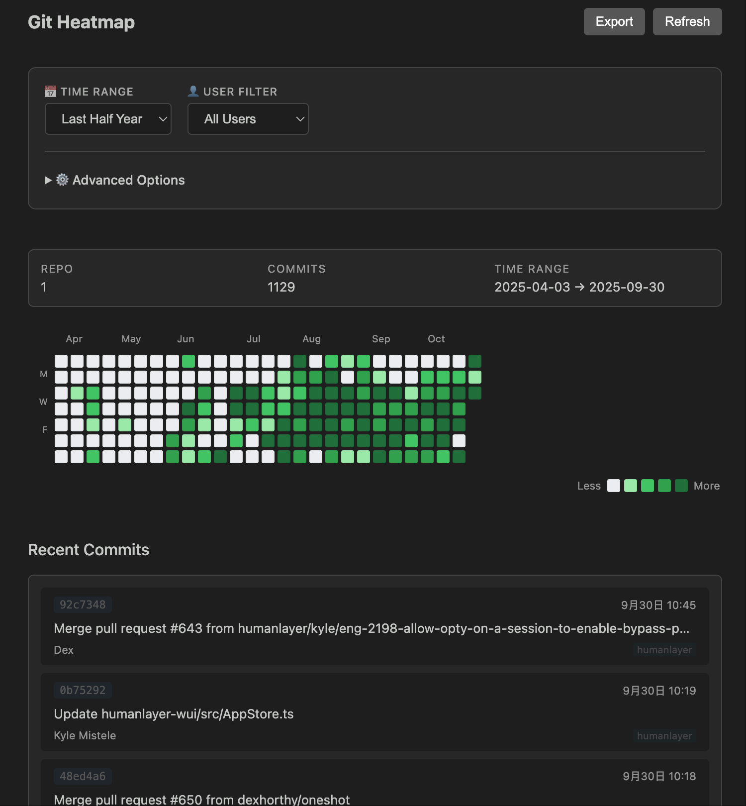
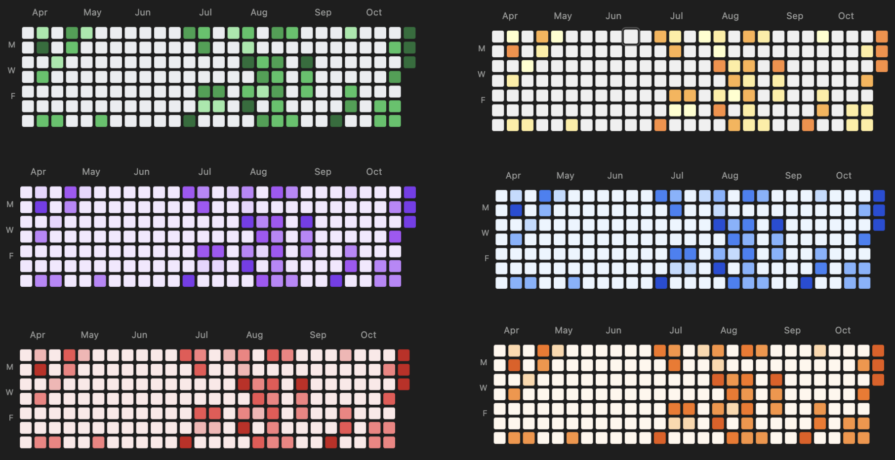
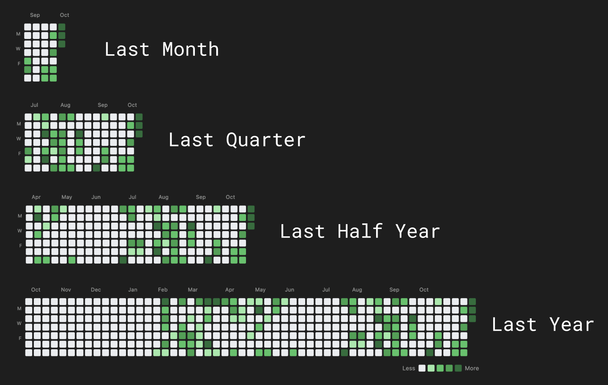
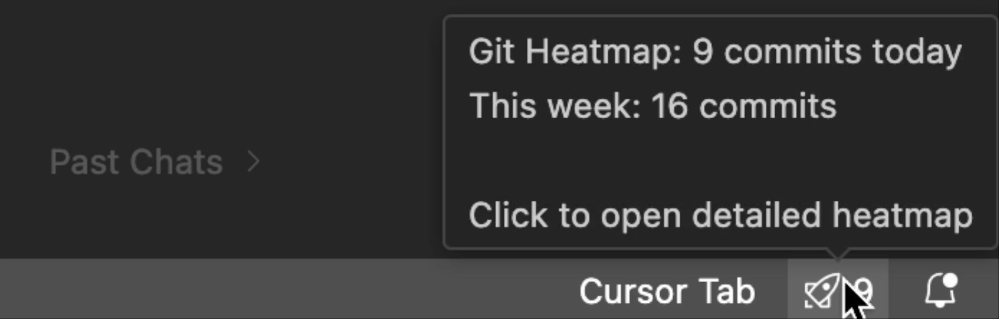
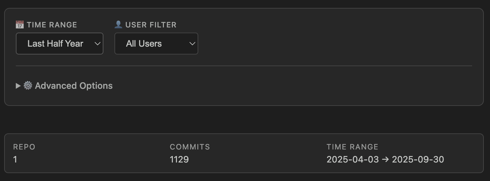
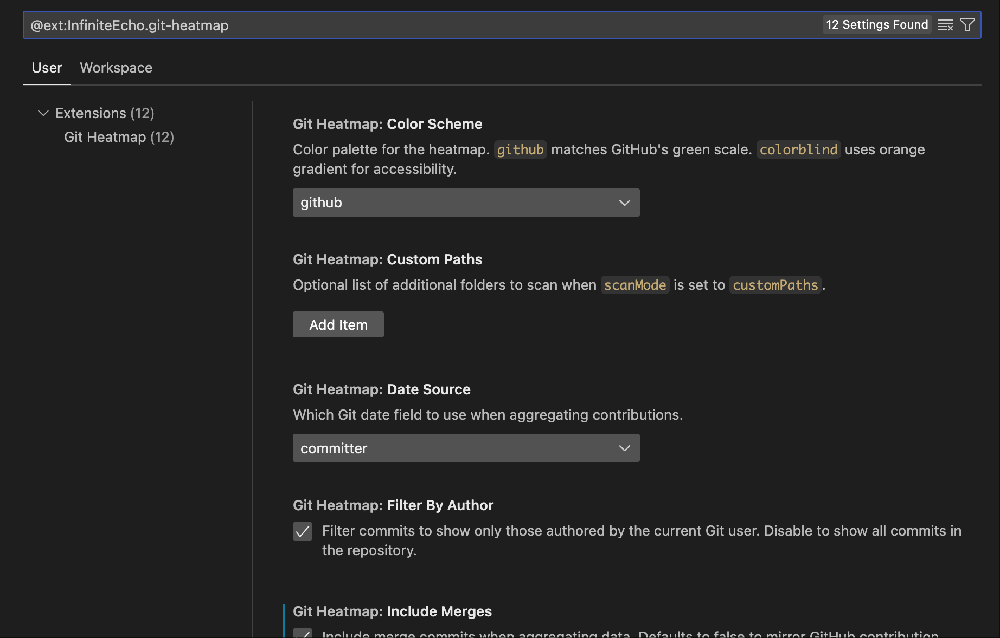

# Git Heatmap (VS Code Extension)

Git Heatmap surfaces a GitHub-style contribution calendar directly inside Visual Studio Code by scanning local Git repositories. The extension runs fully offline, aggregates commit counts per day, and renders an interactive heatmap so you can review activity without leaving the editor.

## Highlights

_Git Heatmap main interface - GitHub-style contribution calendar_

_Multiple color schemes available_

_Flexible date range selection: choose from the last month, quarter, half-year, or full year to suit different analysis needs_

_Status bar showing last 7 days of Git activity_

- **Local & private**: data stays on your machine; no network requests.
- **Multi-repo workspace**: auto-discovers repositories (including nested repos).
- **Interactive heatmap**: GitHub-style calendar with summary and recent commits.
- **Daily commit details**: click any cell to view all commits for that day with repository info.
- **Export capabilities**: save your contribution calendar as SVG or PNG for sharing.
- **Flexible filters**: time range (month/quarter/half-year/year), user (current/all/custom email), include merges, date source (author/committer), color schemes.
- **Accessibility**: colorblind-friendly palette and internationalization support (English/简体中文).
- **Gamification**: achievement notifications to celebrate your coding milestones! 🎉
- **Sticky preferences**: your filters are saved and restored; reset anytime via `Git Heatmap: Reset Filter Settings`.
- **Status bar activity**: shows last 7 days (Today/Week); click to open the panel quickly.
- **Performance-first**: in-memory cache (default 5 min) plus force refresh on demand.

## Commands

- `Git Heatmap: Show` – open the heatmap panel.
- `Git Heatmap: Refresh` – trigger a data refresh (opens the panel if closed).
- `Git Heatmap: Select Repositories` – placeholder for future custom scope selection.
- `Git Heatmap: Reset Filter Settings` – reset filters to defaults.
- `Git Heatmap: Export as SVG` – export your contribution calendar as SVG file.
- `Git Heatmap: Export as PNG` – export your contribution calendar as PNG image.

## Configuration

_Flexible filter options - time range, user filtering, advanced settings_

_Configuration options in VS Code settings panel_

- `gitHeatmap.scanMode` (`workspace` | `customPaths`) – repository discovery strategy (defaults to `workspace`).
- `gitHeatmap.customPaths` – additional folders to include when `scanMode` is `customPaths`.
- `gitHeatmap.metric` (`commits` default) – statistic to visualize.
- `gitHeatmap.colorScheme` (`github` default) – heatmap palette.
- `gitHeatmap.includeMerges` (default `false`) – include merge commits.
- `gitHeatmap.dateSource` (`committer` default) – which date field to aggregate.
- `gitHeatmap.statusBar.enabled` (default `true`) – show last-7-days activity indicator in the status bar.
- `gitHeatmap.statusBar.updateInterval` (default `300000` ms) – status bar refresh interval.
- `gitHeatmap.statusBar.displayMode` (`today` | `week`, default `week`) – status bar display mode.
- `gitHeatmap.statusBar.showAchievements` (default `true`) – show encouraging notifications when reaching new activity levels.
- `gitHeatmap.language` (`auto` | `en` | `zh-CN`, default `auto`) – UI language preference.

## What's New in v0.0.5

- 🎯 **Daily Commit Details Panel**: Click any heatmap cell to view detailed commit information for that day, including commit messages, authors, and repositories.
- 📤 **Export Functionality**: Export your contribution calendar as SVG or PNG files to share your coding journey.
- 🎨 **Colorblind-Friendly Palette**: New `colorblind` color scheme using orange gradients for better accessibility.
- 🌐 **Internationalization**: Full support for English and Simplified Chinese (简体中文), with auto-detection based on VS Code language.
- 🏆 **Achievement System**: Celebrate your coding milestones with encouraging notifications when you reach new activity levels.
- 🐛 **Bug Fixes**: Various stability improvements and performance optimizations.

## License

This project is licensed under the **GNU General Public License v3.0 (GPL-3.0)**.

This means:

- ✅ You can freely use, modify, and distribute this software.
- ✅ If you distribute modified versions, you must also make your source code available under GPL-3.0.
- ✅ You must retain copyright and license notices.
- ❌ You cannot distribute modified versions under a proprietary license.

For the full license text, see the [LICENSE.md](LICENSE.md) file or visit <https://www.gnu.org/licenses/gpl-3.0.html>.

## Development

1. Install dependencies: `npm install`.
2. Compile: `npm run compile` (emits JS into `out/`).
3. Launch the extension host from VS Code (`F5`).

## Contributing

Contributions are welcome! Please note that any contributions will be licensed under GPL-3.0. By submitting a pull request, you agree to license your contribution under the same terms.

## Support

If you encounter any issues or have feature requests, please file them in the [GitHub Issues](https://github.com/DawnLck/GitHeatmap/issues).
