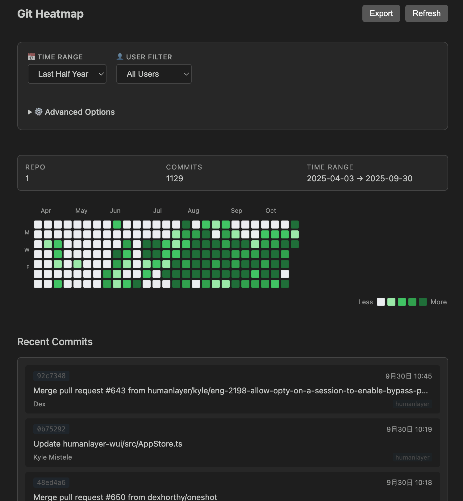
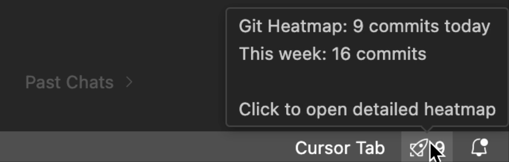
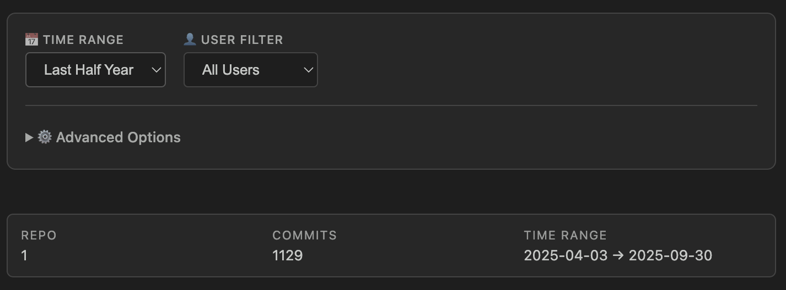
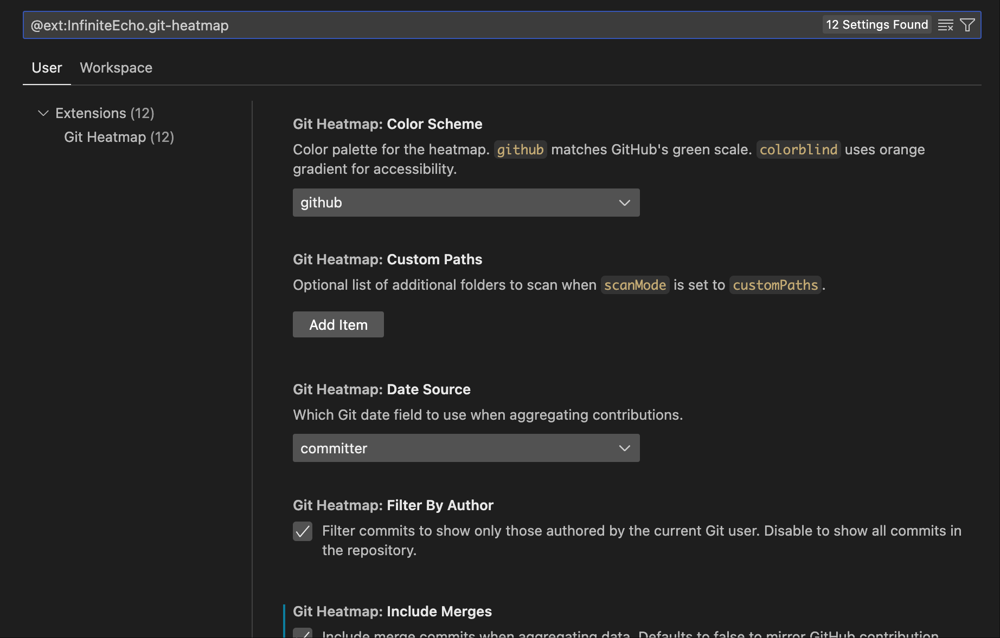

# Git Heatmap（VS Code 扩展）

Git Heatmap 会在 Visual Studio Code 内直接展示一块 GitHub 风格的贡献热图，通过扫描本地 Git 仓库，对每天的提交次数进行聚合，并以交互式面板呈现，让你无需离开编辑器即可快速回顾近期开发节奏。

## 功能亮点

_Git Heatmap 主界面 - GitHub 风格的热图展示_

_状态栏显示近 7 天 Git 活动_

- 离线与隐私：所有数据在本地计算，不经网络传输。
- 多仓库工作区：自动发现工作区内所有 Git 仓库（含嵌套仓库）。
- 交互式热图：GitHub 风格日历视图，附汇总信息与「最近提交」列表。
- 灵活筛选：时间范围（近月/季/半年/年）、用户（当前/全部/自定义邮箱）、是否包含合并、日期源（作者/提交者）、配色方案。
- 记住你的偏好：自动保存并恢复筛选器；可用「Git Heatmap: Reset Filter Settings」一键重置为默认。
- 状态栏活动：展示近 7 天提交（Today/Week）；点击可快速打开热图面板。
- 性能优先：内存缓存（默认 5 分钟），随时强制刷新获得最新数据。

## 命令

- `Git Heatmap: Show` — 打开热图面板。
- `Git Heatmap: Refresh` — 触发数据刷新（若面板关闭会自动打开）。
- `Git Heatmap: Select Repositories` — 为未来的自定义仓库范围选择预留。
- `Git Heatmap: Reset Filter Settings` — 重置筛选器设置为默认值。

## 配置项

_灵活的筛选选项 - 时间范围、用户筛选、高级选项_

_VSCode 设置面板中的配置选项_

- `gitHeatmap.scanMode`（`workspace` | `customPaths`）— 仓库发现策略，默认 `workspace`。
- `gitHeatmap.customPaths` — 当 `scanMode` 为 `customPaths` 时可额外指定的目录列表。
- `gitHeatmap.metric`（默认 `commits`）— 热图展示的统计指标。
- `gitHeatmap.colorScheme`（默认 `github`）— 热图配色方案。
- `gitHeatmap.includeMerges`（默认 `false`）— 是否统计合并提交。
- `gitHeatmap.dateSource`（默认 `committer`）— 聚合时使用的 Git 日期字段。
- `gitHeatmap.statusBar.enabled`（默认 `true`）— 在状态栏显示近 7 天活动指示器。
- `gitHeatmap.statusBar.updateInterval`（默认 `300000` 毫秒）— 状态栏刷新间隔。
- `gitHeatmap.statusBar.displayMode`（`today` | `week`，默认 `week`）— 状态栏显示模式（今日/本周）。

## 开发步骤

1. 安装依赖：`npm install`。
2. 编译 TypeScript：`npm run compile`（编译输出位于 `out/` 目录）。
3. 在 VS Code 中按 `F5` 启动扩展调试会话。
